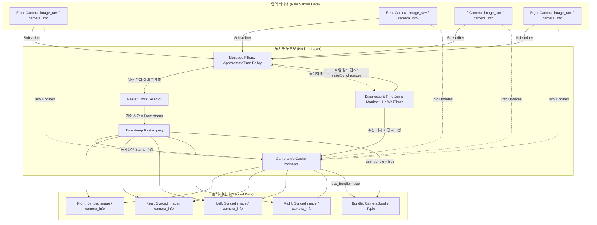

이 노드렛은 **자율주행 시뮬레이터(CarMaker)** 또는 다중 카메라 환경에서 들어오는 비동기적 이미지 스트림들(전/후/좌/우 4개 채널)의 물리적인 타임스탬프 불일치를 해결하고, 후단 센서 퓨전 및 이미지 스티칭(Stitching) 알고리즘에 **시간적으로 정렬된 데이터 그룹**을 보장하기 위해 설계

특히 시뮬레이션 강제 리셋이나 Rosbag 반복 재생(Loop) 시 가상 시간이 갑자기 역행하거나 과도하게 순행하는 **타임 점프(Time Jump)** 발생 시, 기존 동기화 큐가 먹통이 되거나 노후 메시지가 적체되는 락업(Lock-up) 현상을 방지하도록 **자가 치유형 파이프라인 리셋 메커니즘**을 내장

---

## 1. 핵심 아키텍처 및 파이프라인 흐름

이 모듈은 `message_filters`의 근사 시간 동기화 정책(`ApproximateTime Policy`)을 기반으로 동작하며, 4개 채널의 원시 센서 데이터를 수신하여 처리



1. **설정 로드 및 검증**: 초기화 시 YAML 설정 파라미터와 카메라 채널 수(기본 4개)를 로드하고 유효성을 검증
2. **비동기 데이터 수신**: 각 카메라 채널의 `image_raw`와 `camera_info` 데이터를 비동기적으로 수신
3. **근사 시간 동기화**: `message_filters` 버퍼 내에서 지정된 오차 범위(`sync_slop_sec`)에 도달한 4개 이미지 프레임을 하나의 세트로 클러스터링
4. **마스터 클럭 기반 재시각화 (Restamping)**: 동기화된 세트 내의 모든 데이터를 기준이 되는 마스터 채널(기본값: `front`)의 타임스탬프로 통일
5. **동기화 출력**: 개별 토픽으로 발행하거나 하나의 통합 메시지(`carmaker_msgs/CameraBundle`) 형태로 묶어서 배포
6. **타임 점프 자가 치유**: 백그라운드 `ros::WallTimer`는 ROS 시뮬레이션 클럭의 시간 왜곡(Time Jump)을 감시하고 진단 메트릭을 발행하며, 시간이 튀었을 경우 동기화 파이프라인 및 캐시 타이머를 초기화/재작동시킴

---

## 2. 코드 레벨 세부 구현 분석

### 1) Nodelet 기반 제로카피(Zero-Copy) 지향 설계

- **특징**: `nodelet::Nodelet`을 상속받아 구현
    - 단일 프로세스 메모리 영역(Nodelet Manager)에서 실행될 경우, ROS 토픽 통신 시 직렬화/역직렬화 및 네트워크 소켓 바인딩 오버헤드를 우회하고 포인터(`boost::shared_ptr`) 참조 형태로 데이터를 안전하게 전달하여 CPU 및 메모리 대역폭을 보존

### 2) 동기화 성능 최적화: 뮤텍스 분리 (Mutex Splitting)

스레드 경합(Lock Contention)으로 인한 성능 저하를 방지하기 위해 뮤텍스를 이원화

- **`info_mutex_`**: 카메라 내부 파라미터인 `CameraInfo` 캐싱 및 유효 기간(Timeout) 판단 로직을 보호
- **`status_mutex_`**: 진단 메트릭에 기록되는 지연 시간(Slop) 정보 및 상태 조회를 보호
- **효과**: 고빈도로 유입되는 이미지 가공/발행 루프와, 상대적으로 주기가 길거나 독립적인 진단 타이머(Timer) 루프가 서로 락을 잡고 대기(Blocking)하지 않도록 차단

### 3) 락프리 카운터 (Lock-Free Diagnostics Counters)

- **대상 코드**: `image_synchronizer_nodelet.h` L53-L54

```cpp
// Using atomic for high-frequency counter to avoid lock contention in imageRawCallback
std::atomic<uint64_t> received_count{0};
```

- **동작**: 매 이미지 프레임 수신 시 수행되는 `imageRawCallback` 내에서 락(Lock) 없이 원자적으로 호출 횟수를 증가
    - 빈번한 카운트 연산 때문에 락을 획득하고 해제하는 CPU 연산 지연을 최적화

### 4) CameraInfo 캐싱 및 동적 타임아웃 검증

- **동작 원리**: 고해상도 이미지는 매 프레임 수신되는 반면, 카메라 메타데이터(`CameraInfo`)는 일반적으로 한 번만 발행되거나 낮은 주기로 발행하므로 채널마다 `last_info`에 정보를 캐싱
- **동기화 시점**: 이미지가 들어올 때, 캐시된 메타데이터가 최신인지 동적으로 체크(`ros::Time::now() - last_info_time < info_timeout_`). 유효하다면 마스터 타임스탬프를 메타데이터에도 동기화 주입하여 함께 내보냅니다. 만약 설정된 유효 기간(`2.0s`)을 넘기면 stale 경고를 내보내어 비정상 작동을 감지

### 5) 2가지 출력 모드 지원 (Single vs Bundled)

- **개별 토픽 모드 (`use_bundle: false`)**:
각 채널에 대응하는 개별 토픽 `/synced/{front,rear,left,right}/image`과 `camera_info`로 타임스탬프가 정렬된 데이터를 쪼개어 발행.
- **통합 번들 모드 (`use_bundle: true`)**:
커스텀 메시지인 [CameraBundle.msg]구조에 4채널의 이름, 이미지, 카메라 파라미터를 하나의 리스트로 패키징하여 `/synced/bundle` 토픽으로 통일 발행
    - 이 방식은 인지 노드들이 여러 개별 토픽을 각각 기다려 동기화할 필요 없이 하나의 메인 토픽만 수신하면 되도록 후단 시스템의 연산 구조를 대폭 단순화

### 6) 타임 점프 자가 치유 및 파이프라인 리셋 (Time Jump Recovery)

- **감지 원리**: ROS Time 기반의 시뮬레이션 환경에서는 시나리오 리셋, Rosbag 반복 재생(Loop) 시 시간 역행(`dt < -1.0s`) 또는 비정상 순행(`dt > 5.0s`) 형태의 타임 점프가 자주 발생
    - 이를 지연 없이 안전하게 포착하기 위해 실제 현실 시간계로 독립 가동되는 `ros::WallTimer` 콜백 내부에서 가상 ROS 시각의 왜곡을 1Hz 주기로 지속 감시
- **복구 메커니즘 (`resetSynchronizer()`)**:
    1. **동기화기 재생성**: 기존 `message_filters::Synchronizer` 객체를 파괴하고 새로 할당하여, 큐 버퍼에 고여 있던 오래된 시점의 정체 메시지들을 일괄 폐기(Flush)
    2. **캐시 시간 재조정(Re-anchoring)**: 캐싱된 `CameraInfo`의 수신 시각(`last_info_time`)을 현재 시간으로 강제 갱신하여, 시간 리셋에 의해 발생하는 과도한 시간 지연으로 인한 노후화(Stale) 오탐 경고를 사전에 완벽 차단
    3. **메트릭 초기화**: 채널별 수신 횟수 및 동기화 횟수 카운터를 0으로 초기화하여 통계 정보의 신뢰도를 복구
    4. **즉각적인 진단 공유**: 리셋 직후 `diagnostic_updater_->force_update()`를 강제 실행하여 상위 진단 서버에 즉시 상태 정상화를 전파

---

## 3. 핵심 모듈 설정 분석

### 1) 파라미터 파일

- **`settings/master_channel`**: `"front"` 카메라를 기준으로 삼아 해당 타임스탬프(`front/image_raw`의 타임스탬프)로 동기화를 진행
- **`settings/sync_slop_sec`**: `0.05`초(50ms) 오차 이내로 도달한 프레임들을 하나의 프레임 세트로 판정 (만약 20Hz 카메라 시스템이라면 한 프레임 주기인 50ms 이내로 도달하는 4개 이미지를 동기화 집합으로 묶습니다.)
- **`settings/use_bundle`**: `true`로 설정되어 현재 `/synced/bundle` 토픽 하나만 출력
- **`diagnostic_period`**: 진단 보고서 발행 및 타임 점프 독립 감시 주기(`1.0s`) 설정

### 2) 런칭 파일

- 내부적으로 `img_sync_nodelet_manager`라는 자체 매니저 노드를 가동시키고 여기에 `ImageSynchronizerNodelet`을 컴포넌트로 로드
- `foxglove:=true` 아규먼트를 추가해 실행하면 디버깅/시각화를 위해 `foxglove_bridge`를 연동할 수 있도록 구성

---

## 4. 진단 및 결함 허용 (Diagnostics)

이 노드렛은 `diagnostic_updater::Updater`를 활용하여 실시간 상태 진단을 진행

- **WallTimer 기반 독립 주기 구동**: ROS 가상 시각에 종속적인 일반 `ros::Timer` 대신 실제 시스템 시간에 동기화되는 `ros::WallTimer`를 채택하였습니다. 시뮬레이션 클럭이 급격히 뒤틀리거나 정지 상태에 빠져도 타이머 콜백(`timerCallback`)이 안정적으로 구동되어 모니터링 시스템의 마비를 완벽히 예방하고 자가 치유를 트리거
- **실시간 진단 상태 강제 동기화**: 타임 점프 포착 시 대기 주기 없이 `force_update()`를 즉각 동원하여 지연 없는 정상화 패킷을 공유
- **수집 지표**:
    - 동기화 성공 횟수 (`Total Synced Groups`)
    - 마스터 기준 노드 채널명
    - 채널별 수신 횟수 (`Raw Received`) 및 허용 오차 오프셋(`Last Slop`)
    - 채널별 카메라 메타데이터 연결 유실 상태 (`Missing/Stale CameraInfo`)

---

## 5. 설계상의 한계점 및 개선 가능 사항 (Trade-offs & Limitations)

1. **Restamping 과정에서의 깊은 복사 (Deep Copy)**
    - `ROS` 이미지 메시지 포인터는 상수 성격(`const ImageConstPtr`)을 가지므로, 타임스탬프를 덮어쓰려면(`synced_img->header.stamp = sync_time;`) 부득이하게 `boost::make_shared`를 이용해 이미지 픽셀 전체를 메모리에 새로 할당 후 복사
    - **영향**: 해상도가 고해상도(예: 4K 이상)로 올라가거나 카메라 채널 수가 늘어날 경우 복사 비용으로 인한 CPU 점유율 및 메모리 대역폭 소모량이 급격히 증가
2. **정적 채널 바인딩 (Static Channel Binding)**
    - C++ `message_filters::sync_policies::ApproximateTime` 특성상 4개 채널을 템플릿 인자(`ApproximateTime<Image, Image, Image, Image>`)로 선언하여 컴파일
    - **영향**: 서라운드 뷰 및 센서 추가로 인해 카메라가 6채널, 8채널 등으로 확장되는 경우 YAML 파라미터만 변경해서는 동기화가 불가능하며, C++ 소스 코드에서 가변 인자 템플릿(Variadic Template) 기반으로 소스 재구성 및 신규 빌드가 필요
3. **지연 누적 현상 (Latency Accumulation)**
    - 동기화 방식은 4개 채널의 데이터가 모두 한 차례씩 큐에 차야만 한 묶음으로 배포
    - **영향**: 4개 카메라 중 단 1개의 카메라에 네트워크 지터(Jitter)나 하드웨어 지연 스파이크가 발생해도, 나머지 3개 카메라는 그 마지막 프레임이 들어올 때까지 배포되지 못하고 큐 안에서 대기하게 되어 전체 인지 시스템의 종단간 지연시간(End-to-End Latency)이 일시적으로 증가

---

### 요약

Carmaker 이미지 싱크로나이즈 노드렛은 **Nodelet 구조, 뮤텍스 분리, 원자적 연산(Lock-Free Diagnostics)** 등 분산 자율주행 시뮬레이션 환경에 필요한 실시간 다채널 데이터 스케줄링을 안정적이고 안전하게 구현하고 있으며, 새로 보완된 **WallTimer 타임 점프 자가 치유(Self-Healing)** 로직을 통해 시뮬레이션 환경의 불규칙한 시간 복원력까지 담보
