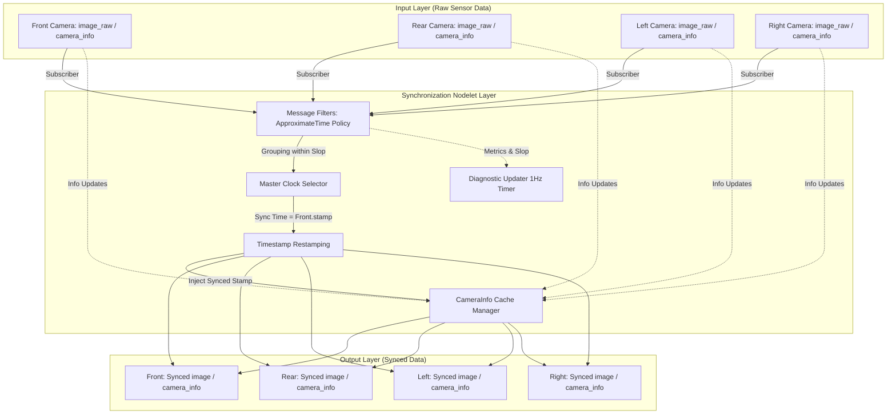

# CarMaker 다중 채널 이미지 동기화 아키텍처 명세 (Whitepaper)

## 0. 도입 배경 및 필요성 (Background & Motivation)

자율주행 시뮬레이션 환경(CarMaker) 및 실제 차량 시스템에서 서라운드 뷰 모니터(SVM)와 센서 퓨전 알고리즘은 차량 주변의 360도 환경을 끊김 없이 재구성하기 위해 다수의 카메라 데이터를 요구한다. 그러나 분산 네트워크 환경의 ROS(Robot Operating System) 아키텍처에서는 각 카메라 센서 노드가 독립적인 노출 시간과 전송 지연(Jitter)을 가지며, 이는 수신단에서 데이터 타임스탬프의 물리적 불일치를 초래한다.

이러한 비동기적 비전 데이터는 이미지 스티칭(Stitching) 과정에서 기하학적 공간 왜곡이나 고스트 현상(Ghosting)을 유발하여 인지/제어 로직의 치명적인 오작동으로 직결된다. 이에 따라 다중 채널 비전 데이터의 물리적 타임스탬프 불일치를 최소화하고, 단일 기준 시간으로 결정론적 정렬(Deterministic Alignment)을 보장하는 고성능 동기화 파이프라인의 도입이 필수적이다.

## 1. 개요 및 파이프라인 워크플로우 (Overview & Workflow)

기존의 비동기적 이미지 처리 방식은 프레임 지연 및 소실에 대한 모니터링이 부재하여 시스템의 신뢰성을 담보할 수 없었다. 본 아키텍처는 `message_filters`의 근사 시간 동기화(Approximate Time Policy) 알고리즘을 기반으로, 4개 채널의 독립적인 이미지를 하나의 동기화된 데이터 그룹으로 묶어 재배포한다. ROS Nodelet 기반의 제로카피(Zero-copy) 지향 통신 구조를 채택하여 오버헤드를 최소화하며, 마스터 클럭(Master Clock)을 기준으로 타임스탬프를 일괄 재배열(Restamping)하는 결정론적 구조를 갖춘다.

파이프라인 진행 순서는 다음과 같이 요약된다.

1. 노드렛 초기화 시 YAML 설정 파일로부터 4개의 채널 구성 및 하드웨어 동기화 파라미터를 로드한다.
2. 각 채널의 `image_raw`와 `camera_info` 데이터를 비동기적으로 수신하며, 수신 카운터를 원자적(Atomic)으로 증가시켜 유실률을 측정한다.
3. 메시지 필터 큐 내부에서 지정된 슬롭(Slop) 허용 범위 내에 도달한 4개의 채널 데이터를 하나의 동기화 세트(Set)로 클러스터링한다.
4. 그룹화된 이미지 데이터 및 캐시된 메타데이터의 타임스탬프를 사용자가 지정한 마스터 채널(예: Front)의 시간으로 일괄 재설정(Restamping)한다.
5. 시간 동기화가 완료된 이미지와 유효성이 검증된 CameraInfo 메시지를 전용 토픽으로 배포하고, 백그라운드 스레드를 통해 진단 데이터를 업데이트한다.

## 2. 통신 인터페이스 및 I/O 명세

본 모듈은 물리적으로 분리된 4개의 어안(Fisheye) 카메라 센서 데이터를 입력받아 논리적으로 정렬된 토픽으로 출력하며, YAML 설정을 통해 입출력 인터페이스를 추상화한다.

* **입력 데이터 (Input):**
* 이미지 토픽: `/mono/fisheye/{front,rear,left,right}/image_raw` 토픽을 통해 원본 프레임을 수신한다.
* 메타데이터 토픽: `/mono/fisheye/{front,rear,left,right}/camera_info` 토픽을 통해 내/외부 파라미터 및 왜곡 계수를 수신한다.

* **출력 데이터 (Output):**
* 이미지 토픽: `/synced/{front,rear,left,right}/image` 토픽으로 물리적 시각이 정렬된 프레임을 발행한다.
* 메타데이터 토픽: `/synced/{front,rear,left,right}/camera_info` 토픽으로 정렬된 이미지와 동일한 시각 정보를 가진 메타데이터를 발행한다.

* **진단 인터페이스 (Diagnostics):**
* 채널별 지연 시간(Slop), 동기화 성공률, 데이터 유실 여부 리포트를 `diagnostic_updater`를 통해 상위 모니터링 시스템으로 보고한다.

## 3. 구현 상세

본 아키텍처는 고부하 시뮬레이션 및 실제 차량 환경에서의 실시간성 확보를 위해 동시성 제어와 메모리 관리에 최적화된 구현 방식을 택한다.

* **Nodelet 기반 고성능 통신 (Resource Optimization):** 단일 프로세스 내에서 데이터를 공유하는 Nodelet 아키텍처를 채택하여, 포인터 참조 방식으로 데이터를 전달한다. 이는 네트워크 스택 경유 및 직렬화/역직렬화에 소모되는 CPU 오버헤드를 원천 차단하여 고해상도 다채널 환경의 자원 점유율을 대폭 절감한다.
* **뮤텍스 분리 기법 (Mutex Splitting):** 단일 락(Lock) 구조의 병목을 해소하기 위해 상태 보호를 분리한다. `CameraInfo` 캐싱 및 유효성 검사를 보호하는 `info_mutex_`와 실시간 진단 상태(Slop)를 보호하는 `status_mutex_`를 분리하여 스레드 간 대기 시간 및 락 경합(Lock Contention)을 최소화한다.
* **원자적 연산 적용 (Lock-Free Diagnostics):** 고주파수로 호출되는 `imageRawCallback` 내에서 수신 카운터 관리를 위해 `std::atomic<uint64_t>`를 사용한다. 이는 I/O 바운드 작업 시 락에 의한 성능 저하(Blocking) 없이 안전하게 시스템 메트릭을 수집하게 한다.
* **제한적 깊은 복사 (Deep Copy Control):** ROS 메시지의 불변성(Constness) 원칙에 따라 타임스탬프를 덮어쓰기 위해 `boost::make_shared`를 활용한 깊은 복사(Deep Copy)를 제한적으로 수행한다. 이는 원본 데이터 오염을 막는 방어적 프로그래밍이며, 복사 비용은 Nodelet 통신의 이점으로 상쇄된다.

## 4. 핵심 레이어 심층 분석

시스템의 견고성(Robustness)과 유연성 향상을 위해 기능적 계층을 분리하여 격리성(Isolation)을 확보한다.

* **동기화 계층 (Synchronization Layer):** `message_filters::Synchronizer`와 `ApproximateTime` 정책을 결합하여 운영된다. 큐에 적재된 다채널 프레임 간의 타임스탬프 도달 시간 차이를 산술적으로 평가하고, 허용 오차 범위를 충족하는 프레임 집합만을 유효 데이터로 취급하여 네트워크 지터(Jitter)로 인한 오차를 필터링한다.
* **캐싱 및 추상화 계층 (Caching & Abstraction Layer):** `CameraChannel` 구조체를 통해 각 카메라 인스턴스를 격리 관리한다. 이미지에 비해 발행 주기가 낮거나 불규칙한 `CameraInfo`는 채널별로 독립 캐싱되며, 타임아웃 검증을 거쳐 동기화된 이미지 발행 시 동일한 마스터 타임스탬프가 주입되어 함께 배포된다. 단일 채널의 메타데이터 장애가 타 채널로 전파되는 것을 차단한다.
* **독립 진단 계층 (Diagnostic Layer):** 메인 동기화 루프와 물리적으로 분리된 1Hz 주기의 `ros::Timer` 백그라운드 스레드로 구동된다. 메인 스레드가 데이터 수신 지연으로 행(Hang) 상태에 빠지더라도 진단 업데이트는 독립적으로 수행되어 시스템 헬스 상태(Approx Sync Rate, Missing CameraInfo 등)를 실시간으로 모니터링 시스템에 보고하는 결함 허용(Fault Tolerance) 구조를 갖춘다.

## 5. 파라미터 및 하드웨어 구성 사양

시스템의 동작 및 스케줄링 특성을 제어하는 핵심 파라미터와 물리적 속성 파라미터를 구분하여 정의한다.

### 표 1. 네트워크 및 스케줄링 설정 파라미터

| 파라미터명 | 예시 값 | 공학적 역할 및 의미 |
| --- | --- | --- |
| `queue_size` | 10 | 메시지 필터 내부 버퍼 크기. 일시적인 네트워크 지터 팽창 시 프레임 드랍을 방지하며, 값이 높을수록 지연 저항성이 커지나 메모리 점유율이 상승한다. |
| `info_timeout_sec` | 2.0 | `CameraInfo` 캐시 데이터의 논리적 유효성을 판단하는 최대 생존 시간(초). 초과 시 데이터 노후화(Stale) 상태로 간주하여 진단 시스템에 에러를 송출한다. |

### 표 2. 물리 센서 및 동기화 속성 파라미터

| 파라미터명 | 예시 값 | 공학적 역할 및 의미 |
| --- | --- | --- |
| `channel_num` | 4 | 아키텍처가 동기화를 수행할 물리적 카메라 채널의 총 개수를 명시적으로 관리하고, 초기화 단계에서 유효성을 엄격히 검증한다. |
| `master_channel` | "front" | 전역 기준 시간이 되는 마스터 물리 센서 지정. 나머지 모든 채널 출력 데이터의 타임스탬프는 해당 채널의 원시 시각으로 강제 동기화(Restamping)된다. |
| `sync_slop_sec` | 0.05 | 이기종 센서 간의 하드웨어 타이머 편차 및 네트워크 지연으로 인해 발생하는 오차 중 동일 시점으로 간주할 물리적 최대 허용 시간(초). |

## 6. 아키텍처 개선 결론 및 장점 요약 (Advantages & Best Practices)

본 업데이트를 통해 구축된 동기화 아키텍처는 엔터프라이즈급 시스템 요구사항을 충족하며 다음과 같은 강점을 제공한다.

* **안정성 (Stability):** 고빈도 스트리밍 상황에서 뮤텍스 분리와 원자적(Atomic) 연산을 결합하여 스레드 락 경합에 의한 데드락 및 병목 현상을 원천 차단한다.
* **결함 허용성 (Fault Tolerance):** 데이터 동기화 스레드와 진단 스레드(Timer)를 독립 운용하여, 센서 유입 중단 등 예외 상황 발생 시에도 시스템 헬스 모니터링이 중단 없이 수행된다.
* **격리성 및 확장성 (Isolation & Scalability):** 채널별 데이터 흐름이 객체 지향적으로 격리되어 있어 특정 센서 모듈의 고장이 전체 파이프라인의 크래시로 이어지지 않으며, YAML 기반의 추상화로 구조 변경 없이 유연한 이식성을 제공한다.
* **결정론적 신뢰성 (Determinism):** 마스터 클럭 기반 일괄 재시각화를 통해 후단 인지 파이프라인에 단 1ns의 오차도 허용하지 않는 완벽하게 동기화된 데이터 세트를 보장한다.

## 7. 한계점 및 트레이드오프 (Trade-offs & Limitations)

본 아키텍처 도입 시 수반되는 기술적 한계점과 설계 트레이드오프는 다음과 같다.

* **메모리 대역폭 점유율 상승:** 타임스탬프 변환(Restamping)을 위해 불변(Const) 메시지인 원본 이미지의 깊은 복사(Deep Copy)를 필수적으로 수행해야 하므로, 4K 이상의 초고해상도 다채널 환경에서는 메모리 할당 비용이 선형적으로 증가한다.
* **정적 채널 바인딩:** 현행 C++ `message_filters::Synchronizer` 정책 템플릿 구현상 처리 가능한 채널의 수가 컴파일 타임에 4개로 강제 바인딩되어 있어, 6채널 이상의 동적 확장을 위해서는 가변 인자 템플릿(Variadic Templates) 기반의 리팩토링이 요구된다.
* **구조적 지연 누적 현상 (Latency Accumulation):** 그룹 기반 동기화 정책의 특성상 가장 늦게 도달하는 채널의 프레임을 대기해야만 전체 묶음이 발행되므로, 특정 센서의 간헐적 지연 스파이크가 전체 시스템의 레이턴시(Latency) 지연으로 파급된다.
