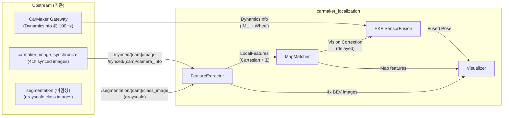
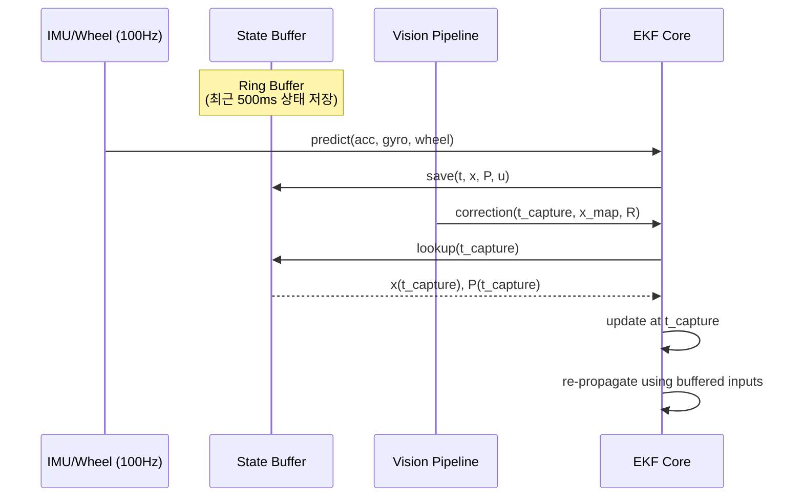

# `carmaker_localization` 패키지 설계 명세

## 0. 설계 원칙 ([CLAUDE.md](http://claude.md/) 준수)

> **Simplicity First.** 단일 용도 추상화 금지. 요청된 기능만 구현.
**Surgical Changes.** 기존 `carmaker_image_synchronizer` 코드에 손대지 않음.
**Goal-Driven.** 각 모듈은 독립적으로 검증 가능한 명확한 성공 기준을 가짐.
>

---

## 1. 시스템 컨텍스트



### 확정 사항

| # | 결정 | 근거 |
| --- | --- | --- |
| 1 | 세그멘테이션 결과(그레이스케일 클래스 이미지)를 **외부 토픽으로 수신** | `segmentation` 패키지가 별도 존재 (미완성). 결합도 최소화 |
| 2 | EKF는 **2D 우선**, 인터페이스는 3D 확장 가능하게 설계 | CarMaker 평면 주행. 추후 경사로/입체 주차장 대응 |
| 3 | 지도 포맷은 **OSM 우선**, 로더 인터페이스 추상화 | 범용성 확보. 추후 Lanelet2, PCD 등 확장 |
| 4 | 매칭 알고리즘은 **ICP 우선**, 매처 인터페이스 추상화 | 구현 단순. 추후 NDT, Point-to-Line 교체 가능 |
| 5 | 차량 파라미터는 **placeholder**, 추후 정확한 값 설정 | CarMaker 차량 모델 확인 후 반영 |

---

## 2. 데이터 소스 분석 (`DynamicsInfo.msg`)

### 2.1 IMU 데이터 (Prediction Primary)

| 필드 | 단위 | EKF 역할 |
| --- | --- | --- |
| `Sensor_Inertial_0_Acc_B_{x,y,z}` | m/s² | 선가속도 → 속도/위치 적분 |
| `Sensor_Inertial_0_Omega_B_{x,y,z}` | rad/s | 각속도 → 자세 적분 |

### 2.2 Wheel Encoder 데이터 (Prediction Secondary)

| 필드 | 단위 | EKF 역할 |
| --- | --- | --- |
| `Vhcl_{FL,FR,RL,RR}_rotv` | rad/s | 후륜 평균으로 종방향 속도 추정 |
| `Vhcl_{FL,FR,RL,RR}_rz` | rad | 조향각 추정 (전륜 차이로 Ackermann 역산) |
| `Steer_WhlAng` | rad | 핸들 조향각 (교차 검증용) |

### 2.3 Ground Truth (검증 전용, 추정에 사용 금지)

| 필드 | 용도 |
| --- | --- |
| `Car_{x,y,z}`, `Car_{Roll,Pitch,Yaw}` | EKF 출력과의 오차 비교 |

---

## 3. 모듈 상세 설계

### 3.1 FeatureExtractor

**역할**: 세그멘테이션 클래스 이미지 수신 → 개별 BEV 변환 → Cartesian 특징점 추출 (비등방성 공분산 포함)

### 입출력

| 방향 | 토픽 | 타입 | 비고 |
| --- | --- | --- | --- |
| IN | `/synced/{cam}/image` | `sensor_msgs/Image` | BEV 변환 원본 |
| IN | `/synced/{cam}/camera_info` | `sensor_msgs/CameraInfo` | K, D (내부 파라미터) |
| IN | `/segmentation/{cam}/class_image` | `sensor_msgs/Image` (mono8) | 그레이스케일 클래스 맵 |
| IN | TF: `base_link` → `{cam}_optical_frame` | `tf2` | 외부 파라미터 |
| OUT | `/localization/features/{cam}/local_features` | `LocalFeatures` (신규) | 알고리즘용 |
| OUT | `/localization/features/{cam}/bev_image` | `sensor_msgs/Image` | 디버깅용 |

> [!NOTE]
`segmentation` 패키지 미완성 시, FeatureExtractor는 **원본 synced 이미지를 직접 BEV 변환**하여 단순 threshold 기반 추출로 동작합니다. 세그멘테이션 토픽 수신 시 자동 전환됩니다 (fallback 모드).
>

### 처리 흐름

```
1. CameraInfo(K, D) + TF(Extrinsic) 수신
2. BEV 매핑 테이블(LUT) 생성 (초기 1회, TF 변경 시 재계산)
   - BEV 픽셀 (u,v) → 지면점 (X,Y,0) in base_link
   - 지면점 → 카메라 좌표계 변환 (TF)
   - 카메라 좌표 → 왜곡된 원본 픽셀 (fisheye project)
   - cv::remap용 map1, map2 저장
3. 매 프레임:
   a. cv::remap(raw_image, bev_raw, map1, map2) — 디버깅 BEV 출력
   b. cv::remap(class_image, bev_class, map1, map2, INTER_NEAREST) — 클래스 보존
4. bev_class에서 class_id > 0인 픽셀을 특징점으로 추출
5. BEV 픽셀 좌표에서 base_link 기준 (X, Y) 직접 조회 (LUT에 이미 존재)
6. 비등방성 공분산 직접 계산:
   - r = sqrt(X² + Y²)
   - e_r = (X, Y) / r  (방사 방향 단위벡터)
   - e_t = (-Y, X) / r (접선 방향 단위벡터)
   - σ_r² = k · r² / f² (거리 비례 증가)
   - σ_t² = resolution²  (BEV 해상도, 거의 상수)
   - Σ = σ_r²·e_r·e_rᵀ + σ_t²·e_t·e_tᵀ
7. LocalFeatures 메시지 발행
```

### 핵심 설계 결정

- **Single-pass remap**: 왜곡 보정 + BEV 투영을 하나의 `cv::remap`으로 통합. 연산량 절반.
- **동일 LUT 공유**: raw 이미지와 class 이미지에 동일한 매핑 테이블을 사용. class 이미지는 `INTER_NEAREST` 보간으로 클래스 ID 훼손 방지.
- **4채널 독립 처리**: 각 카메라의 BEV는 독립적. SVM 합성과 달리 모든 유효 픽셀 보존.
- **직접 Cartesian 출력**: BEV 픽셀이 이미 `base_link` 기준 Cartesian 좌표. 좌표 변환 없이 직접 $(X, Y, \Sigma)$ 출력. ICP/EKF 모두 선형 공간에서 바로 연산 가능.

### 신규 메시지 정의

```
# carmaker_msgs/msg/LocalFeature.msg
float32 x          # base_link 기준 X 좌표 (m)
float32 y          # base_link 기준 Y 좌표 (m)
float32 cov_xx     # 공분산 Σ(0,0)
float32 cov_xy     # 공분산 Σ(0,1) = Σ(1,0)
float32 cov_yy     # 공분산 Σ(1,1)
uint8   class_id   # 0=background, 1=lane, 2=landmark
```

```
# carmaker_msgs/msg/LocalFeatures.msg
Header header
string camera_name
LocalFeature[] features
```

---

### 3.2 EKF Sensor Fusion

**역할**: IMU + Wheel → 고주파 예측, Vision → 저주파 보정

### 상태 벡터 (2D: 11-state)

$$\mathbf{x} = [x, y, \psi, v_x, v_y, \dot\psi, b_{ax}, b_{ay}, b_{gz}, \delta, s_w]^T$$

| 인덱스 | 상태 | 설명 | 3D 확장 시 추가 |
| --- | --- | --- | --- |
| 0-1 | $x, y$ | 위치 | $z$ |
| 2 | $\psi$ | Yaw | $\phi, \theta$ (Roll, Pitch) |
| 3-4 | $v_x, v_y$ | 선속도 (Body) | $v_z$ |
| 5 | $\dot\psi$ | Yaw rate | $\dot\phi, \dot\theta$ |
| 6-7 | $b_{ax}, b_{ay}$ | 가속도계 바이어스 | $b_{az}$ |
| 8 | $b_{gz}$ | 자이로 z축 바이어스 | $b_{gx}, b_{gy}$ |
| 9 | $\delta$ | 조향각 | — |
| 10 | $s_w$ | 휠 속도 스케일팩터 | — |

> [!TIP]
**3D 확장 전략**: 상태 벡터 크기를 `enum`으로 관리하고, 2D/3D 모드를 컴파일 타임 또는 YAML 설정으로 전환할 수 있도록 `StateIndex` 구조체를 사용합니다. 핵심 수식(`predict`, `update`)은 `Eigen::Matrix<double, N, 1>` 템플릿으로 차원에 무관하게 동작합니다.
>

### 예측 모델 (Prediction)

**IMU Integration (Primary, ~100Hz)**:

```
dx/dt = vx·cos(ψ) - vy·sin(ψ)
dy/dt = vx·sin(ψ) + vy·cos(ψ)
dψ/dt = ωz - b_gz
dvx/dt = ax_imu - b_ax + vy·ωz
dvy/dt = ay_imu - b_ay - vx·ωz
```

**Wheel Odometry Update (Secondary, ~100Hz)**:

```
v_wheel = R_tire · s_w · avg(rotv_RL, rotv_RR)
```

- 측정 모델: $z_{wheel} = v_x$
- $s_w$: 휠 스케일팩터 (타이어 마모/공기압 변화 보상, 온라인 추정)
- 측정 노이즈 $R_{wheel}$: 슬립 감지 시 동적 증가
    - 슬립 판별: $|v_{wheel} - v_{imu}| > \text{threshold}$
    - 슬립 시: $R_{wheel} \leftarrow R_{wheel} \times 10$

### 보정 모델 (Correction)

**Vision MapMatcher Update (~10-30Hz, delayed)**:

- 측정값: $(x_{map}, y_{map}, \psi_{map})$ — 맵 매칭으로 얻은 절대 위치/헤딩
- 동적 공분산 $R_{vision}$:

    ```
    R_vision = diag(σ²_x, σ²_y, σ²_ψ)
    σ²_x = Σ(cov_xx_i) / N,  σ²_y = Σ(cov_yy_i) / N
    (LocalFeatures의 개별 공분산 행렬에서 직접 집계)
    ```


### **진단 시각화 (Diagnostics)**

- **공분산 타원**: 현재 추정 위치의 $P_{xy}$를 RViz Marker로 발행. 보정 시 수축 확인용.
- **고스트 차량**: 지연 보정 시점($T_{sync}$)의 과거 포즈를 반투명 마커로 발행. 롤백 매커니즘 검증용.

### 지연 보상 (Delay Compensation)



**구현**: 링 버퍼에 `(timestamp, state, covariance, input)` 튜플 저장. Vision 데이터 도착 시 과거 상태를 찾아 보정 후, 버퍼의 IMU/Wheel 입력으로 현재까지 재적분.

### 입출력

| 방향 | 토픽 | 타입 | 주기 |
| --- | --- | --- | --- |
| IN | `/dynamics_info` | `DynamicsInfo` | 100Hz |
| IN | `/localization/map_correction` | `geometry_msgs/PoseWithCovarianceStamped` | ~10Hz |
| OUT | `/localization/pose` | `geometry_msgs/PoseWithCovarianceStamped` | 100Hz |
| OUT | `/localization/odom` | `nav_msgs/Odometry` | 100Hz |

---

### 3.3 MapMatcher

**역할**: LocalFeatures + 현재 EKF Pose → OSM 지도 대조 → 절대 위치 보정

### 지도 로더 인터페이스

```cpp
// 추상 인터페이스 — OSM 외 포맷 확장 시 이것만 구현
class MapLoaderBase {
public:
    virtual ~MapLoaderBase() = default;
    virtual bool load(const std::string& path) = 0;
    virtual std::vector<MapFeature> queryNear(
        double x, double y, double radius) const = 0;
};

class OsmMapLoader : public MapLoaderBase { /* 1차 구현 */ };
// class Lanelet2MapLoader : public MapLoaderBase { /* 추후 */ };
// class PcdMapLoader     : public MapLoaderBase { /* 추후 */ };
```

### 매칭 알고리즘 인터페이스

```cpp
// 추상 인터페이스 — ICP 외 알고리즘 확장 시 이것만 구현
class MatcherBase {
public:
    virtual ~MatcherBase() = default;
    virtual MatchResult match(
        const std::vector<LocalFeature>& observed,
        const std::vector<MapFeature>& reference,
        const Eigen::Isometry2d& initial_guess) = 0;
};

class IcpMatcher : public MatcherBase { /* 1차 구현 */ };
// class NdtMatcher        : public MatcherBase { /* 추후 */ };
// class PointToLineMatcher : public MatcherBase { /* 추후 */ };
```

### 처리 흐름

```
1. LocalFeatures 수신 (4채널 통합, 이미 Cartesian)
2. EKF 현재 Pose 기준으로 OSM 지도에서 근방 특징점 조회
3. ICP 매칭으로 (dx, dy, dψ) 오차 산출 — 좌표 변환 불필요
4. Fitness Score 기반 유효성 판정
5. 유효 시: PoseWithCovarianceStamped 발행
   - header.stamp = 원본 이미지 캡처 시각 (지연 보상용)
   - covariance = 매칭된 특징점들의 Σ 집계
6. 무효 시: 발행하지 않음 (EKF Dead Reckoning 유지)
```

### 입출력

| 방향 | 토픽/소스 | 타입 |
| --- | --- | --- |
| IN | `/localization/features/{cam}/local_features` | `LocalFeatures` |
| IN | `/localization/pose` (EKF 예측) | `PoseWithCovarianceStamped` |
| IN | OSM 파일 (launch 시 로드) | `.osm` |
| OUT | `/localization/map_correction` | `PoseWithCovarianceStamped` |

---

### 3.4 Visualizer

**역할**: 디버깅 전용. SVM 이미지 + 포인트/매칭 오버레이.

### 출력 토픽

| 토픽 | 내용 |
| --- | --- |
| `/localization/debug/svm_image` | 4채널 BEV를 합성한 SVM 이미지 |
| `/localization/debug/points_overlay` | SVM 위에 LocalFeatures를 클래스별 컬러 마킹 (공분산 타원 포함) |
| `/localization/debug/map_match_overlay` | 지도 특징점(파랑) vs 관측 특징점(빨강) 비교 |
| `/localization/debug/ekf_markers` | EKF에서 발행한 공분산 타원 및 고스트 차량 마커 수집/재발행 |

---

## 4. 패키지 구조

```
carmaker_localization/
├── CMakeLists.txt
├── package.xml
├── nodelet_plugins.xml
├── config/
│   ├── localization_params.yaml    # BEV, EKF, 매칭 설정
│   └── vehicle_params.yaml         # 차량 물리 파라미터 (placeholder)
├── include/carmaker_localization/
│   ├── feature_extractor.h         # BEV + Cartesian 특징점 추출
│   ├── ekf_core.h                  # EKF 상태/예측/보정
│   ├── state_buffer.h              # 지연 보상용 링 버퍼
│   ├── map_loader_base.h           # 지도 로더 인터페이스
│   ├── osm_map_loader.h            # OSM 구현체
│   ├── matcher_base.h              # 매칭 알고리즘 인터페이스
│   ├── icp_matcher.h               # ICP 구현체
│   └── visualizer.h                # SVM 디버그 뷰
├── src/
│   ├── feature_extractor.cpp
│   ├── ekf_core.cpp
│   ├── state_buffer.cpp
│   ├── osm_map_loader.cpp
│   ├── icp_matcher.cpp
│   ├── visualizer.cpp
│   └── localization_nodelet.cpp    # 단일 진입점
└── launch/
    └── localization.launch
```

> [!IMPORTANT]
**단일 Nodelet 진입점**: `carmaker_image_synchronizer` 관례를 따름. `localization_nodelet.cpp`가 유일한 Nodelet이며, 내부에서 모듈 객체를 소유합니다.
>

---

## 5. 구현 로드맵

### Phase 1: FeatureExtractor + Visualizer

```
1. 패키지 뼈대 (CMakeLists, package.xml)   → verify: catkin build 성공
2. LocalFeature.msg, LocalFeatures.msg 정의  → verify: rosmsg show 확인
3. BEV remap LUT 생성 로직                  → verify: 단일 카메라 BEV 이미지 출력
4. Segmentation fallback 모드               → verify: 세그멘테이션 없이 threshold 동작
5. Cartesian 추출 + 비등방성 공분산 계산     → verify: rostopic echo 특징점 데이터
6. SVM 디버그 Visualizer                     → verify: rqt_image_view 확인
```

### Phase 2: EKF Core

```
1. IMU prediction Dead Reckoning            → verify: GT 대비 드리프트 측정
2. Wheel odometry 보정 추가                 → verify: 드리프트 감소 확인
3. State buffer + 지연 보상 프레임워크       → verify: 버퍼 정합성 단위 테스트
```

### Phase 3: MapMatcher + 통합

```
1. OSM 로더 구현                            → verify: 지도 파싱 및 queryNear 테스트
2. ICP 매칭 구현                            → verify: 정적 시나리오 매칭 정확도
3. EKF delayed correction 연결             → verify: GT 대비 최종 위치 정밀도
```

---

## 6. 핵심 설정 파라미터

### `localization_params.yaml`

```yaml
feature_extractor:
  bev:
    x_range: [-10.0, 10.0]    # base_link 기준 좌우 (m)
    y_range: [-5.0, 15.0]     # base_link 기준 후방-전방 (m)
    resolution: 0.05           # m/pixel
  extraction:
    r_max: 15.0                # 최대 감지 거리 (m)
    covariance_k: 1.0          # 방사 방향 공분산 스케일 계수
  segmentation:
    # 세그멘테이션 토픽 수신 실패 시 fallback: raw 이미지 threshold
    fallback_enabled: true
    fallback_threshold: 40     # grayscale 임계값
  channels:
    - {name: front, frame: front_optical_frame,
       seg_topic: /segmentation/front/class_image}
    - {name: rear,  frame: rear_optical_frame,
       seg_topic: /segmentation/rear/class_image}
    - {name: left,  frame: left_optical_frame,
       seg_topic: /segmentation/left/class_image}
    - {name: right, frame: right_optical_frame,
       seg_topic: /segmentation/right/class_image}

ekf:
  dimension: 2                 # 2 or 3 (3D 확장 시)
  frequency: 100.0             # Hz
  state_buffer_duration: 0.5   # 지연 보상 버퍼 (초)
  imu_noise:
    acc_std: 0.1               # m/s²
    gyro_std: 0.01             # rad/s
  wheel_noise:
    speed_std: 0.05            # m/s
    slip_threshold: 0.5        # m/s (초과 시 공분산 10배)
  vision_noise:
    base_std: 0.1              # m (거리 0m 기준)

map_matcher:
  type: "icp"                  # "icp" | "ndt" | "point_to_line" (확장)
  map_format: "osm"            # "osm" | "lanelet2" | "pcd" (확장)
  map_file: ""                 # launch에서 지정
  search_radius: 20.0          # m (지도 조회 반경)
  fitness_threshold: 0.5       # 매칭 유효 판정 임계값
  max_iterations: 50           # ICP 반복 횟수
```

### `vehicle_params.yaml` (placeholder — 추후 정확한 값 설정)

```yaml
# TODO: CarMaker 차량 모델 확인 후 정확한 값 반영
vehicle:
  tire_radius: 0.31            # m (placeholder)
  wheelbase: 2.7               # m (placeholder)
  track_width: 1.6             # m (placeholder)
  steering_ratio: 15.0         # 핸들-타이어 기어비 (placeholder)
```

---

## 7. 트레이드오프 요약

| 항목 | 결정 | 확장 전략 |
| --- | --- | --- |
| EKF 차원 | **2D (11-state)** | `StateIndex` enum + Eigen 템플릿으로 3D 전환 |
| Nodelet 구조 | **단일 진입점** | — |
| 세그멘테이션 | **외부 토픽 수신** + fallback | 토픽 미수신 시 자동 threshold 모드 전환 |
| 지도 포맷 | **OSM 우선** | `MapLoaderBase` 인터페이스 상속 |
| 매칭 알고리즘 | **ICP 우선** | `MatcherBase` 인터페이스 상속 |
| 차량 파라미터 | **placeholder** | `vehicle_params.yaml` 분리, 추후 업데이트 |

> [!WARNING]
`DynamicsInfo.msg`의 `Sensor_Inertial_0_Aplha_B_*` 필드명에 오타가 있음 (`Aplha` → `Alpha`). 하위 호환성을 위해 현재 필드명을 그대로 사용합니다.
>