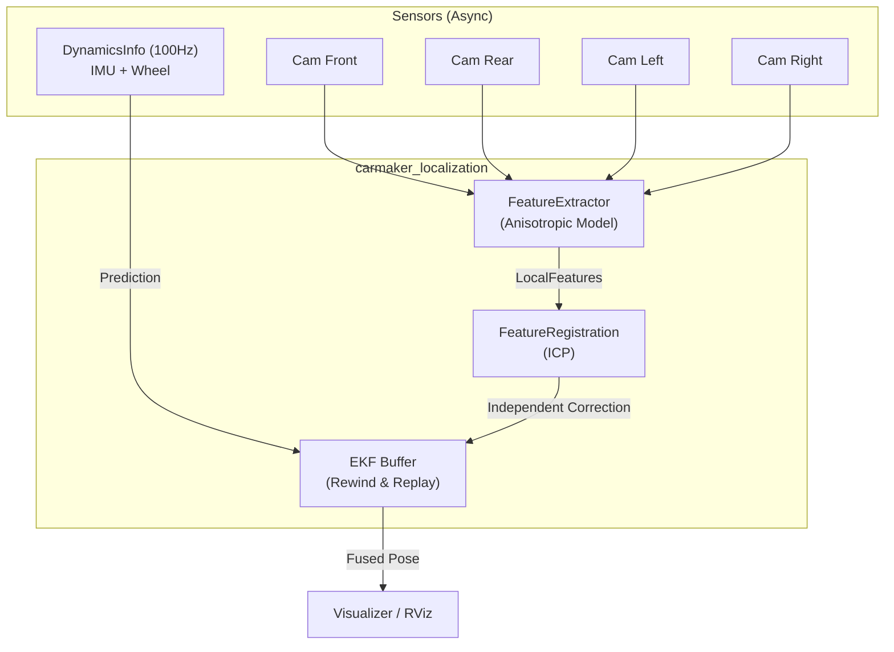

# `carmaker_localization` 패키지 설계 명세

## 0. 설계 원칙 ([CLAUDE.md](http://claude.md/) 준수)

> **Simplicity First.** 단일 용도 추상화 금지. 요청된 기능만 구현.
>
> **Surgical Changes.** 기존 `carmaker_image_synchronizer` 코드에 손대지 않음.
>
> **Goal-Driven.** 각 모듈은 독립적으로 검증 가능한 명확한 성공 기준을 가짐.

---

## 1. 시스템 아키텍처

### 1.1 비동기 독립 보정 시스템 (Asynchronous Fusion)

**Goal:** 센서 동기화 오버헤드 없이 실시간으로 4개 카메라를 EKF에 동시 보정.

본 시스템은 4대의 카메라 데이터를 하나로 묶지 않고, 각 센서가 데이터를 발행하는 즉시 개별적으로 EKF를 보정하는 구조를 취합니다.

### 1.2 핵심 설계 결정

| 항목 | 결정 | 근거 |
| --- | --- | --- |
| **보정 방식** | 독립 비동기 업데이트 | Single Point of Failure 방지 및 처리 지연(Latency) 최소화 |
| **지연 보상** | Rewind & Replay / Kinematic bicycle 선도 보상 | 비전 처리 지연 동안 발생한 차량 이동량을 후륜 축 기준 기구학 모델로 과거 시점부터 선도 보상 |
| **공분산 모델** | 동적 비등방성 모델 | 카메라 설치 각도 및 거리에 따른 투영 오차의 기하학적 반영 |
| **안정성 가드** | Validation Gate, Rate Limiter, Trace 발산 감지 | 오정합 차단(Validation Gate), 급격한 거동 도약 방지(Rate Limiter), 필터 오염 자가 치유(Trace 리셋) |

---

## 2. 공분산 모델링 (Covariance Modeling)

### 2.1 특징점 단위 공분산 (Feature-level)

각 특징점은 카메라 광축과 지면의 교점인 `optimal_point`를 기준으로 거리에 비례하는 비등방성 공분산($\Sigma_{feat}$)을 가집니다.

- **Radial Error ($\sigma_r$):** 카메라 중심에서 특징점을 잇는 시선 방향. 거리에 비례하여 급격히 증가.
- **Tangential Error ($\sigma_t$):** 시선 수직 방향. BEV 해상도에 비례하는 일정한 오차.
- **수식:** $\sigma_r^2 = k \cdot (dist\_to\_optimal^2 + 1) / f^2$

### 2.2 측정치 단위 공분산 (Update-level)

- **휠 속도 노이즈 ($R_{wheel}$):** 추정 속도($V_x$)와 휠 속도의 차이가 `slip_threshold`를 넘을 경우 노이즈를 10배 인플레이션.
- **비전 보정 노이즈 ($R_{vision}$):** ICP 정합에 성공한 인라이어(Inlier) 특징점들의 정보 행렬(Hessian) 역행렬에 정합 신뢰도를 반영하여 산출. 정합 품질이 낮거나 방향성 제약이 없을 경우 공분산 자동 인플레이션.

---

## 3. 모듈 상세 설계

### 3.1 EKF Sensor Fusion (EkfCore)

**상태 벡터 (3-state):** $\mathbf{x} = [x, y, \psi]^T$

- **기준 좌표계 설정:**
  - 위치($x, y$)와 요각($\psi$)은 **후륜 축(Rear Axle) 중심** 기준.
  - 종방향 속도와 yaw rate는 상태가 아니라 `DynamicsInfo` 기반 motion input으로 사용.

**수학적 최적화 및 강건성:**

1. **각도 정규화 최적화:** 삼각함수 호출을 배제하고 분기문(`if`) 기반의 `normalizeAngle`을 사용하여 고주파 루프 성능 극대화.
2. **발산 감지 (Divergence Guard):** 업데이트 후 공분산 행렬의 Trace가 임계값을 초과하면 초기 공분산으로 소프트 리셋하여 운영 계속성 확보.
3. **지연 보상 알고리즘:**
   - 비전 데이터 수신 시 현재 EKF state timestamp 기준으로 정합 결과를 선도 보상.
   - state history buffer 없이 최신 state에 직접 pose correction 적용.
4. **보정치 변화율 제한기 (Rate Limiter):**
   - EKF 보정 갱신값($dx$)이 급격하게 업데이트되어 차량 위치가 도약(Jump)하는 현상을 막기 위해, 스텝당 최대 허용 위치 보정량(`max_position_step`) 및 요각 보정량(`max_yaw_step`)을 설정하여 갱신량을 클램핑(Clamping)함으로써 부드러운 수렴을 보장.

### 3.2 FeatureExtractor & FeatureRegistration

- **Fisheye 모델 대응:** 시뮬레이터 환경의 특성을 고려하여 왜곡 계수 $D=0$ (Ideal 모델) 적용.
- **Single-pass Remap:** 왜곡 보정과 BEV 투영을 단일 LUT로 통합하여 연산 효율 최적화.
- **Independent Registration:** 각 카메라 채널은 독립적인 ICP Registration Engine을 소유하며, 타 채널의 지연에 간섭받지 않고 보정 데이터 발행.
- **유효성 검증 게이트 (Validation Gate):**
  - EKF 예측치 기준 최대 허용 정합 위치 편차(`max_position_dev`) 및 요각 편차(`max_yaw_dev`)를 설정하여, 로컬 미니마 오정합(Outlier/False Positive) 발생 시 보정치를 완전히 기각(Reject)함으로써 필터 안정성을 보호.

---

## 4. 시뮬레이션 환경 구성 (CarMaker)

### 4.1 카메라 파라미터 가이드

- **Distortion ($D$):** `[0, 0, 0, 0]` (시뮬레이터의 수학적 어안 모델은 이미 완벽함을 가정).
- **Intrinsics ($K$):** CarMaker FOV와 이미지 해상도 기반으로 산출된 초점거리($f$) 필수 반영.

### 4.2 센서 구성

- **DynamicsInfo (100Hz):** IMU와 휠 인코더 데이터를 통합 수신. `Aplha` 필드명 오타 등 시뮬레이터 특이사항 대응 완료.
