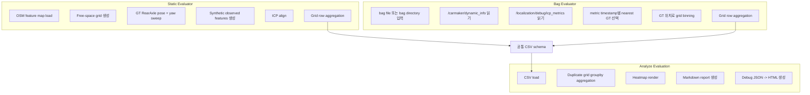

# ICP 정합 평가 파이프라인

이 문서는 `carmaker_localization`의 ICP 정합 평가 도구인 `static_evaluator`, `bag_evaluator`, `analyze_evaluation.py`의 목적, 데이터 계약, 집계 규칙, 지표 해석, 실행 절차를 정리한다.

평가 기준점은 모두 **GT RearAxle**이다. Bag 기반 평가는 EKF 출력인 `/localization/pose`를 사용하지 않고, `/localization/debug/icp_metrics`에 기록된 ICP 단독 결과를 GT와 비교한다.

---

## 1. 평가 목표

ICP 평가는 두 종류의 입력을 같은 CSV schema로 정규화한다.

| 평가 | 입력 | 목적 | 출력 |
| --- | --- | --- | --- |
| Static evaluation | OSM map + 합성 관측 피처 | 지도 형상만으로 ICP 수렴 가능 영역과 취약 grid를 분석 | `grid_registration_results.csv`, `landmarks.csv`, debug JSON |
| Bag evaluation | 정지 spawn bag + ICP metrics | 실제 segmentation/feature extraction/ICP 결과를 GT grid별로 검증 | `grid_registration_results.csv` |
| Analysis | evaluator CSV | heatmap, summary, detail, debug HTML 생성 | `heatmap_*.png`, `evaluation_summary.md`, `evaluation_detail.md`, `icp_debug_*.html` |

두 evaluator는 공통 `EvaluationRow`와 `writeCsvHeader()`를 사용한다. 따라서 정적 평가 결과와 bag 평가 결과는 동일한 분석 스크립트로 처리할 수 있다.

---

## 2. 전체 구조



중요한 경계는 다음과 같다.

- Static evaluation은 **이상 조건의 지도 기반 평가**다.
- Bag evaluation은 **정지 spawn 상태에서 수집한 실제 ICP metric 평가**다.
- Map-to-map debug는 **성능 지표가 아니라 수렴 과정 시각화 도구**다.
- `/localization/pose`는 EKF 결과이므로 ICP 단독 평가에 사용하지 않는다.

---

## 3. 좌표계와 기준점

### 3.1 평가 기준

CSV에 기록되는 pose error는 GT RearAxle pose 기준으로 계산한다.

```
dx = estimated_rear_x - gt_rear_x
dy = estimated_rear_y - gt_rear_y
dyaw = normalize(estimated_rear_yaw - gt_rear_yaw)
```

종방향/횡방향 오차는 GT 차량 프레임으로 투영한다.

```
longitudinal =  cos(gt_yaw) * dx + sin(gt_yaw) * dy
lateral      = -sin(gt_yaw) * dx + cos(gt_yaw) * dy
```

### 3.2 RearAxle와 Bumper

ICP registration 내부 transform은 map frame 기준 bumper pose를 의미한다. 정적 평가와 metrics publisher는 이를 RearAxle 기준으로 변환한 뒤 GT와 비교한다.

```
rear_pose = bumper_pose translated by rear_axle_offset_x along bumper yaw
```

Bag 평가에서는 `IcpRegistrationMetrics.msg`의 다음 필드를 사용한다.

```
icp_rear_x
icp_rear_y
icp_rear_yaw
```

---

## 4. 공통 CSV Schema

| 컬럼 | 의미 | 집계 기준 |
| --- | --- | --- |
| `grid_i`, `grid_j` | grid index | GT RearAxle 위치를 `center_x`, `center_y`, `grid_step` 기준으로 binning |
| `cell_x`, `cell_y` | grid center 좌표 | grid index에서 역산한 cell center |
| `mean_observed_count` | 평균 관측 피처 수 | 모든 attempt 평균 |
| `landmark_count` | 평균 landmark 수 | 모든 attempt 평균 |
| `attempts` | ICP 시도 수 | static은 yaw sample 수, bag은 metric frame 수 |
| `success_count` | ICP 성공 수 | `success == true`인 attempt 수 |
| `success_rate` | 성공률 | `success_count / attempts` |
| `mean_fitness` | 평균 final fitness score | 성공 attempt 평균 |
| `mean_iterations` | 평균 ICP iteration 수 | 성공 attempt 평균 |
| `mean_latency_ms` | 평균 ICP 처리 시간 | 성공 attempt 평균 |
| `longitudinal_rmse` | GT frame 종방향 RMSE | 성공 attempt 오차 제곱합으로 계산 |
| `lateral_rmse` | GT frame 횡방향 RMSE | 성공 attempt 오차 제곱합으로 계산 |
| `yaw_rmse` | yaw RMSE | 성공 attempt yaw 오차 제곱합으로 계산 |
| `cov_xx`, `cov_yy`, `cov_yawyaw` | 축별 pose covariance | 성공 attempt 평균 |
| `cov_trace` | covariance trace | 성공 attempt 평균 |
| `cov_determinant` | covariance determinant | 성공 attempt 평균 |

실패 attempt도 `attempts`, `mean_observed_count`, `landmark_count`에는 반영한다. 실패 위치에서 관측 피처 부족, landmark 부족, 시도 횟수 부족을 진단하기 위해서다. 반대로 pose error, fitness, latency, covariance는 성공 attempt에서만 의미가 있으므로 성공 기준으로 집계한다.

### 4.1 IcpRegistrationMetrics 메시지 스키마 및 데이터 계약

실시간 위치추정 노드렛(`localization_nodelet`)은 정합 성공/실패 시 모두 `/localization/debug/icp_metrics` 토픽으로 `carmaker_msgs/IcpRegistrationMetrics.msg` 메시지를 발행합니다. 실시간 EKF correction 루프에는 참값(GT) 정보가 없으므로 사후 분석용 필드들은 사전에 약속된 방식으로 실시간 노드와 사후 평가기(`bag_evaluator`) 간에 분담하여 채워집니다.

| 필드 그룹 | 메시지 필드명 | 실시간 발행 시 (`localization_nodelet`) | 사후 집계 시 (`bag_evaluator`) |
| --- | --- | --- | --- |
| **Grid 정보** | `grid_i`, `grid_j`, `cell_x`, `cell_y` | `0` 또는 `NaN`으로 초기화 | GT RearAxle 위치 기준으로 Binning 연산하여 격자 좌표 채움 |
| **포즈 및 공분산** | `icp_rear_x`, `icp_rear_y`, `icp_rear_yaw`, `cov_*` | 범퍼 기준 ICP 정합 출력을 차량 후륜(RearAxle) 프레임으로 변환(`transformPose`, `propagateCovariance`)하여 계산된 값 채움 | 성공 프레임들에 대한 누적 평균값 산출 |
| **오차 지표** | `longitudinal_rmse`, `lateral_rmse`, `yaw_rmse` | `NaN`으로 초기화 | 매칭된 GT RearAxle 샘플과의 오차 제곱합으로 RMSE 재계산 |
| **성공/실패 여부** | `success`, `fitness_score`, `iterations`, `latency_ms` | ICP 원시 정합 모듈의 처리 결과 그대로 채움 | 성공률(`success_rate`) 및 성공 attempt에 대한 가중 평균 집계 |

- **후륜 축 프레임 전파:** 실시간 정합 모듈의 포즈 결과(`result.transform`) 및 공분산(`result.covariance`)은 차량 범퍼 기준입니다. EKF 교정 및 메트릭 기록을 위해 `rear_axle_offset_x` 만큼 후륜 축 방향으로 투영하여 좌표계 및 강체 공분산 전파 법칙을 적용하여 계산합니다.

---

## 5. Static Evaluator

`static_evaluator.cpp`는 지도 랜드마크(landmark)만으로 ICP의 이상 조건 성능을 평가한다.

### 5.1 입력 파라미터

| 파라미터 | 기본값 | 의미 |
| --- | --- | --- |
| `map_file` | 필수 | OSM feature map |
| `center_x`, `center_y` | `0.0`, `-4.33` | grid 원점 |
| `grid_step` | `1.0` | grid 간격 |
| `num_yaw_angles` | `4` | grid마다 평가할 yaw sample 수 |
| `sensor_range` | `15.0` | 합성 관측 feature 가시 반경 |
| `rear_axle_offset_x` | `0.82` | RearAxle와 bumper 기준점 사이 offset |
| `fitness_threshold` | `0.35` | ICP 성공 판정 threshold |
| `max_iterations` | `50` | ICP 최대 반복 수 |
| `min_search_radius` | `5.0` | matching search radius 하한 |
| `max_covariance` | `10.0` | covariance eigenvalue 상한 |
| `vision_base_std` | `0.1` | covariance floor noise |
| `vision_base_yaw_std` | `0.1` | yaw covariance floor noise |
| `output_csv_path` | `grid_registration_results.csv` | CSV 출력 경로 |
| `output_dir` | `docs` | debug JSON/HTML 및 분석 출력 경로 |
| `landmarks_csv_path` | `landmarks.csv` | heatmap overlay용 landmark CSV |

### 5.2 평가 절차

1. OSM map을 읽어 랜드마크(landmark)와 occupancy grid를 생성한다.
2. occupancy grid의 free cell을 grid 평가점으로 만든다.
3. 각 grid center에 GT RearAxle pose를 배치한다.
4. `num_yaw_angles`만큼 yaw를 균등 sweep한다.
5. GT RearAxle pose를 GT bumper pose로 변환한다.
6. 랜드마크(landmark)를 GT bumper frame으로 역변환하고, `sensor_range` 안의 feature만 합성 관측으로 사용한다.
7. ICP initial guess는 GT bumper pose 자체를 사용한다.
8. ICP 성공 시 RearAxle 기준 pose error와 covariance를 누적한다.
9. no-offset 조건인데 position error가 `kSuccessPositionErrorMeters = 0.15 m` 이상이면 비정상 결과로 보고 성공 집계에서 제외한다.

정적 평가는 “초기 오차 복원 능력” 평가가 아니다. 기본 grid 평가는 initial guess가 GT와 동일한 이상 조건에서 지도 형상 자체가 ICP에 충분한 구속을 제공하는지 확인한다.

### 5.3 Debug Pose

`debug_poses`가 설정되면 별도의 debug JSON을 생성한다.

| 출력 | 내용 |
| --- | --- |
| `icp_debug_XXX.json` | GT, initial offset, observed feature, landmark, iteration trace, association |
| `icp_debug_index.csv` | debug pose index와 JSON/HTML 파일 이름 |
| `icp_debug_XXX.html` | `analyze_evaluation.py`가 template과 JSON을 결합해 생성 |

`debug_poses`의 `offset_x`, `offset_y`, `offset_yaw_deg`는 ICP 수렴 과정을 보기 위한 initial guess offset이다. 이것은 정적 grid 평가의 no-offset 조건과 분리해서 해석해야 한다.

---

## 6. Bag Evaluator

`bag_evaluator.cpp`는 정지 상태에서 수집한 bag들을 하나의 grid CSV로 집계한다.

### 6.1 필요한 Topic

Bag에 필요한 topic은 다음 두 개다.

```bash
rosbag record --duration=5 \
  -O /workspace/src/carmaker_localization/data/bags/grid_i000_j000_run01.bag \
  /carmaker/dynamic_info \
  /localization/debug/icp_metrics
```

`/localization/pose`는 EKF 결과이므로 기록할 필요가 없다. ICP 단독 평가에서는 사용하지 않는다.

### 6.2 Bag Path

`bag_path`에는 단일 `.bag` 파일 또는 `.bag` 파일이 들어 있는 디렉터리를 지정할 수 있다.

```bash
roslaunch carmaker_localization evaluator.launch mode:=bag \
  bag_path:=/workspace/src/carmaker_localization/data/bags
```

디렉터리를 지정하면 내부 `.bag` 파일을 이름순으로 모두 읽고, grid별로 누적한다.

### 6.3 시간 정책

현재 bag 평가는 정지 spawn bag을 전제로 한다. 따라서 `max_match_dt` 기반 skip을 수행하지 않는다.

각 ICP metric마다 가장 가까운 GT sample을 선택한다.

```
metric timestamp -> nearest /carmaker/dynamic_info sample
```

정지 상태에서는 pose가 시간에 따라 거의 변하지 않으므로 nearest GT 정책이 충분하다. 동적 주행 bag의 시간 동기화 검증을 목적으로 설계된 evaluator는 아니다.

### 6.4 Grid Aggregation

각 metric frame은 nearest GT 위치로 grid에 binning된다.

```
grid_i = round((gt_x - center_x) / grid_step)
grid_j = round((gt_y - center_y) / grid_step)
cell_x = center_x + grid_i * grid_step
cell_y = center_y + grid_j * grid_step
```

집계 규칙은 다음과 같다.

| 값 | 규칙 |
| --- | --- |
| `attempts` | 모든 metric frame 수 |
| `success_count` | `metric.success == true`이고 `icp_rear_*`가 finite인 frame 수 |
| `success_rate` | `success_count / attempts` |
| `mean_observed_count` | 모든 attempt 평균 |
| `landmark_count` | 모든 attempt 평균 |
| `mean_fitness` | 성공 frame 평균 |
| `mean_iterations` | 성공 frame 평균 |
| `mean_latency_ms` | 성공 frame 평균 |
| RMSE | 성공 frame 오차 제곱합 기반 재계산 |
| `cov_*` | finite covariance 값 평균 |

동일 grid에 여러 bag 또는 여러 frame이 있어도 최종 CSV에는 grid별 row 하나만 출력된다.

---

## 7. Analyze Evaluation

`analyze_evaluation.py`는 evaluator CSV를 읽어 heatmap과 markdown report를 생성한다.

### 7.1 입력과 출력

기본 경로는 `config/localization_params.yaml`의 `evaluator` 항목을 사용한다. 명령행 첫 번째 인자로 CSV 경로를 넘기면 그 경로를 우선한다.

```bash
python3 src/carmaker_localization/scripts/analyze_evaluation.py \
  src/carmaker_localization/grid_registration_results.csv
```

출력물은 `output_dir`에 생성된다.

| 출력 | 설명 |
| --- | --- |
| `heatmap_*.png` | metric별 grid heatmap |
| `evaluation_summary.md` | 전체 metric 통계 요약 |
| `evaluation_detail.md` | grid별 상세 table |
| `icp_debug_*.html` | debug JSON 기반 interactive viewer |

### 7.2 Duplicate Grid 처리

CSV에 동일한 `grid_i`, `grid_j` row가 여러 개 있어도 `aggregate_duplicate_grids()`가 groupby aggregation을 수행한다.

| 값 | groupby 규칙 |
| --- | --- |
| `attempts`, `success_count` | 합산 |
| `success_rate` | 합산된 `success_count / attempts` |
| `mean_observed_count`, `landmark_count` | `attempts` 가중 평균 |
| `mean_fitness`, `mean_iterations`, `mean_latency_ms` | `success_count` 가중 평균 |
| RMSE | RMSE를 다시 제곱해 `success_count` 가중 RMSE로 재계산 |
| `cov_*` | `success_count` 가중 평균 |

이 처리는 여러 CSV를 병합했거나, evaluator 외부에서 row가 중복된 입력을 넣었을 때 heatmap에 grid cell이 중복 렌더링되는 것을 막는다.

### 7.3 Heatmap 항목

현재 생성하는 heatmap은 다음과 같다.

| 분류 | 항목 |
| --- | --- |
| Feature count | `mean_observed_count`, `landmark_count` |
| Attempt/success | `attempts`, `success_count`, `success_rate` |
| ICP quality | `mean_fitness`, `mean_iterations`, `mean_latency_ms` |
| Pose error | `longitudinal_rmse`, `lateral_rmse`, `yaw_rmse` |
| Covariance | `cov_trace`, `cov_determinant`, `cov_xx`, `cov_yy`, `cov_yawyaw` |

Heatmap 색상 계산은 `inf`를 NaN으로 치환한 Series에서 값을 읽는다. 따라서 비정상 값이 colormap에 직접 들어가지 않는다. `landmarks.csv`가 있으면 landmark가 heatmap 위에 overlay된다. 이 overlay는 관측 feature가 아니라 ICP matching 대상인 landmark다.

---

## 8. Fitness Score 해석

Fitness score는 최종 ICP pose를 적용한 뒤 관측 feature가 landmark와 충분히 가깝게 맞은 비율이다.

```
fitness = inlier_count / valid_observed_count
```

여기서 inlier는 다음 조건을 만족하는 관측 feature다.

1. 같은 class of landmark 후보가 search radius 안에 존재한다.
2. 최종 pose로 변환한 관측 feature와 landmark 사이의 Mahalanobis distance가 threshold 안에 있다.

따라서 fitness는 단순한 “현재 iteration에서 선택된 matching pair 수”가 아니다.

Debug HTML의 iteration trace에는 해당 반복에서 SVD update에 사용한 matching pair가 기록된다. 이 값은 unique matching, class matching, search radius 조건의 영향을 받는다. 반면 최종 fitness는 ICP가 끝난 뒤 최종 pose에서 전체 valid observed feature를 다시 검증해 계산한다.

예를 들어 다음 두 값은 서로 다른 의미다.

```
최종 Fitness Score = 0.9479
현재 단계 매칭 비율 = 385 / 652 = 0.5905
```

첫 번째 값은 최종 검증 inlier 비율이고, 두 번째 값은 해당 iteration trace에 기록된 matching pair 비율이다.

---

## 9. Covariance 해석

ICP covariance는 최종 inlier들의 정보 행렬 Hessian에서 유도된다. 2D pose 상태는 `[x, y, yaw]`이며 covariance는 다음 형태다.

```
Sigma =
[ cov_xx    cov_xy    cov_xyaw
  cov_yx    cov_yy    cov_yyaw
  cov_yawx  cov_yawy  cov_yawyaw ]
```

### 9.1 Trace

`cov_trace`는 diagonal variance의 합이다.

```
cov_trace = cov_xx + cov_yy + cov_yawyaw
```

전체 pose 불확실성의 크기를 빠르게 보는 데 유용하다.

### 9.2 Determinant

`cov_determinant`는 3차 covariance ellipsoid의 부피에 해당한다.

```
cov_determinant = det(Sigma)
```

값이 매우 작다고 해서 곧바로 문제는 아니다. 각 축 분산이 작으면 determinant는 곱의 형태라 쉽게 0에 가까워진다. 특히 안정적인 정합에서 `cov_xx`, `cov_yy`, `cov_yawyaw`가 모두 작으면 determinant는 표시상 거의 0처럼 보일 수 있다.

문제로 봐야 하는 경우는 다음이다.

- determinant가 NaN이다.
- determinant가 음수다.
- RMSE가 큰데 covariance만 지나치게 작다.
- 특정 방향 feature 구속이 약한데 `cov_trace`나 diagonal variance가 작게 나온다.

따라서 covariance 해석은 determinant 하나가 아니라 `cov_xx`, `cov_yy`, `cov_yawyaw`, `cov_trace`, RMSE, success rate를 함께 봐야 한다.

---

## 10. Interactive Debug HTML

`icp_debug_*.html`은 static debug JSON을 시각화한다. 세 가지 view mode가 있다.

| Mode | 의미 | 용도 |
| --- | --- | --- |
| Fixed Map | 절대 지도 좌표계 고정 | 관측 feature가 최종/반복 pose로 landmark에 붙는지 확인 |
| Sensor Frame | 차량 bumper frame 고정 | 차량 기준에서 landmark와 sensor range 관계 확인 |
| Map-to-Map Debug & Heatmap | moving landmark를 reference landmark에 정합 | 알고리즘 수렴 과정과 heatmap을 별도 과제로 확인 |

Map-to-map debug는 관측 feature 기반 ICP 평가와 다르다. 절대 지도와 차량 bumper 기준 view는 “관측 정합”을 보는 화면이고, map-to-map view는 “지도-지도 정합 수렴 과정”을 보는 화면이다.

상단의 최종 fitness는 선택한 mode의 최종 검증 결과를 의미한다. 상세 패널의 “현재 단계 매칭 비율”은 현재 slider iteration에서 trace에 기록된 matching pair 비율이다.

---

## 11. 실행 절차

### 11.1 정적 평가

```bash
roslaunch carmaker_localization evaluator.launch mode:=static grid_step:=1.0

python3 src/carmaker_localization/scripts/analyze_evaluation.py
```

정적 평가는 지도 feature 분포가 ICP에 충분한 기하학적 구속을 제공하는지 확인하는 1차 검증이다.

### 11.2 정지 Bag 평가

Bag 저장 디렉터리를 만든다.

```bash
mkdir -p /workspace/src/carmaker_localization/data/bags
```

grid center에 차량을 spawn하고 정지 상태에서 bag을 수집한다.

```bash
rosbag record --duration=5 \
  -O /workspace/src/carmaker_localization/data/bags/grid_i000_j000_run01.bag \
  /carmaker/dynamic_info \
  /localization/debug/icp_metrics
```

여러 grid 또는 반복 run의 bag을 같은 디렉터리에 모은 뒤 평가한다.

```bash
roslaunch carmaker_localization evaluator.launch mode:=bag \
  bag_path:=/workspace/src/carmaker_localization/data/bags

python3 src/carmaker_localization/scripts/analyze_evaluation.py
```

---

## 12. 현재 구현의 한계와 주의점

- Bag evaluator는 정지 spawn bag 전제다. 동적 주행 bag의 시간 동기화 검증에는 적합하지 않다.
- `evaluator.launch`에 남아 있는 `max_match_dt` 인자는 현재 bag evaluator에서 사용하지 않는다.
- Static grid 평가는 initial guess가 GT bumper pose인 no-offset 이상 조건이다.
- Initial offset 수렴성은 `debug_poses`의 interactive HTML로 별도 확인한다.
- Map-to-map debug는 성능 평가 row가 아니라 ICP 수렴 과정 분석 도구다.
- Fitness score와 iteration matching ratio는 같은 값이 아니다.
- Covariance determinant는 보조 지표다. RMSE, diagonal covariance, trace, success rate와 함께 해석해야 한다.

---

## 13. KD-Tree 캐싱 및 성능 최적화

`IcpRegistration::align` 메서드는 정합 시마다 클래스별 KD-Tree 인덱스를 $O(N \log N)$으로 빌드합니다. `static_evaluator`와 같이 수천 개의 격자 셀과 다중 Yaw 각도를 병렬 루프로 평가하는 조건에서는 이 인덱스 빌드가 큰 병렬 병목(Bottleneck)이 됩니다. 이를 해결하기 위해 다음과 같은 캐싱 설계를 도입했습니다.

### 13.1 thread_local 캐시 구조

- **Lock-free 병렬 처리:** OpenMP의 각 작업 스레드는 자신만의 `thread_local KDTreeCache` 객체를 가집니다. 스레드 간 락 경쟁(Mutex contention)이 전혀 없으므로 멀티코어 환경의 병렬 확장성이 극대화됩니다.
- **메모리 안정성:** KD-Tree 인덱스가 참조하는 클래스별 랜드마크 맵(`landmarks_by_class`)의 사본을 스레드 로컬 영역에 안전하게 상주시켜, 정합 함수가 호출을 마친 후에도 포인터가 댕글링(Dangling Reference)되지 않도록 수명을 관리합니다.

### 13.2 캐시 무효화 (Cache Invalidation) 검증 키

실시간 EKF 교정 과정이나 여러 평가 환경에서 입력되는 랜드마크 세트가 변경되는 경우를 안전하게 감지하기 위해 아래의 **삼중 비교 가드(Triple-Check Guard)**를 수행하며, 조건 중 하나라도 다를 경우 캐시를 재생성합니다.

1. `landmarks.data()`: 입력 랜드마크 벡터의 내부 힙 버퍼 주소 비교
2. `landmarks.size()`: 랜드마크 특징점의 총 개수 비교
3. `landmarks.front().x`: 첫 번째 특징점의 기하적 위치(X 좌표) 변동 여부 비교
